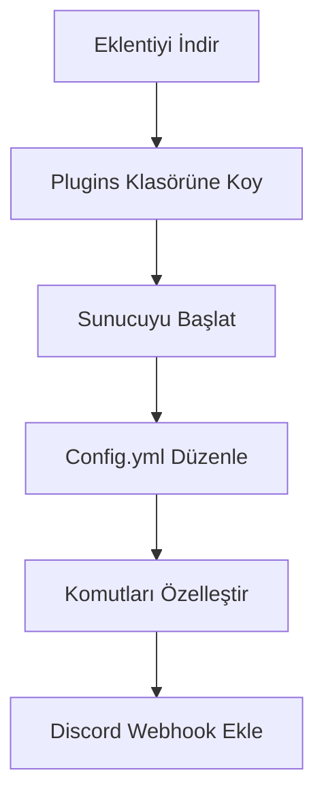

<div align="center">
  
# 🛡️ Turkish Profanity Detection

**Minecraft için gelişmiş Türkçe küfür ve hakaret tespit sistemi**

[](https://github.com/KynuxCloud/TurkishProfanityDetection/releases)
[](https://www.minecraft.net)
[](https://discord.kynux.cloud)


</div>

## 📋 İçindekiler

- [✨ Genel Bakış](#-genel-bakış)
- [📱 Özellikler](#-özellikler)
- [🚀 Kurulum](#-kurulum)
- [⚙️ Yapılandırma](#️-yapılandırma)
- [🔧 Komutlar ve İzinler](#-komutlar-ve-izinler)
- [📊 PlaceholderAPI](#-placeholderapi)
- [📞 Discord Entegrasyonu](#-discord-entegrasyonu)
- [📈 Performans](#-performans)
- [🔍 Yapay Zeka Modeli](#-yapay-zeka-modeli)
- [❓ SSS](#-sss)
- [📝 Lisans](#-lisans)

## ✨ Genel Bakış

**Turkish Profanity Detection**, Minecraft sunucularınız için yapay zeka destekli, Türkçe odaklı küfür ve hakaret tespit sistemidir. Bu eklenti, gelişmiş algoritmalar kullanarak basit kelime filtrelerinin tespit edemediği gizli küfürleri ve hareketleri algılar.

<div align="center">
  
### 🌟 **v1.0.0 - Yeni Minecraft Check API'si ile daha akıllı moderasyon!** 🌟

</div>

## 📱 Özellikler

<table>
  <tr>
    <td width="50%">
      <h3>🧠 Yapay Zeka Desteği</h3>
      <ul>
        <li>Claude 3.7 Sonnet tabanlı bağlam analizi</li>
        <li>Karakter değiştirme hilelerini tespit eder</li>
        <li>Fonetik benzerliği analiz eder</li>
      </ul>
    </td>
    <td width="50%">
      <h3>⚡ Yeni Aksiyon Önerileri</h3>
      <ul>
        <li>AI tarafından önerilen otomatik aksiyonlar</li>
        <li>Warn, mute, kick veya ban önerileri</li>
        <li>İçerik ciddiyetine göre yaptırım</li>
      </ul>
    </td>
  </tr>
  <tr>
    <td width="50%">
      <h3>📊 Detaylı İstatistikler</h3>
      <ul>
        <li>Oyuncu bazlı küfür istatistikleri</li>
        <li>Günlük, haftalık ve aylık raporlar</li>
        <li>Küfür şiddet düzeyi analizleri</li>
      </ul>
    </td>
    <td width="50%">
      <h3>🔌 Kolay Entegrasyon</h3>
      <ul>
        <li>Discord webhook entegrasyonu</li>
        <li>PlaceholderAPI desteği</li>
        <li>MySQL/SQLite veritabanı desteği</li>
      </ul>
    </td>
  </tr>
</table>

## 🚀 Kurulum

1. [TurkishProfanityDetection-1.0.0.jar](https://kynux.cloud/downloads/TurkishProfanityDetection-1.0.0.jar) dosyasını indirin
2. Dosyayı sunucunuzun `plugins` klasörüne yerleştirin
3. Sunucuyu yeniden başlatın
4. İsteğe bağlı olarak `config.yml` dosyasını özelleştirin



## ⚙️ Yapılandırma

Eklentinin `config.yml` dosyasında birçok ayarı özelleştirebilirsiniz:

| Bölüm | Açıklama |
|-------|----------|
| `api` | API bağlantı ayarları ve minecraft-check endpoint yapılandırması |
| `action-recommendations` | AI tarafından önerilen aksiyonların komutları |
| `actions` | Küfür tespit edildiğinde yapılacak genel işlemler |
| `severity-actions` | Şiddet seviyesine göre (1-5) özel aksiyonlar |
| `statistics` | Veritabanı yapılandırması ve istatistik seçenekleri |
| `discord` | Discord webhook entegrasyonu |
| `messages` | Özelleştirilebilir mesajlar |

### Yeni API Yapılandırması

```yaml
api:
  url: "http://api.kynux.cloud/api/swear/minecraft-check"
  timeout: 30000 # milisaniye cinsinden (30 saniye)

# API tarafından önerilen aksiyonlar
action-recommendations:
  warn: "warn %player% Uygunsuz içerik tespit edildi"
  mute: "mute %player% %time% Uygunsuz içerik"
  mute-time: "5m"
  kick: "kick %player% Uygunsuz içerik nedeniyle"
  ban: "tempban %player% %time% Uygunsuz içerik"
  ban-time: "1d"
```

## 🔧 Komutlar ve İzinler

### Komutlar

| Komut | Açıklama |
|-------|----------|
| `/tpd help` | Tüm komutları ve açıklamaları gösterir |
| `/tpd reload` | Eklentiyi ve ayarları yeniden yükler |
| `/tpd stats <oyuncu>` | Bir oyuncunun küfür istatistiklerini gösterir |
| `/tpd clear <oyuncu>` | Oyuncunun tüm istatistiklerini temizler |
| `/tpd test <mesaj>` | API bağlantısını belirtilen mesajla test eder |

### İzinler

| İzin | Açıklama |
|------|----------|
| `turkishprofanitydetection.bypass` | Kontrol ve cezalandırmalardan muaf tutar |
| `turkishprofanitydetection.admin` | Yönetici bildirimlerini ve komutlarını erişimi sağlar |
| `turkishprofanitydetection.commands` | Tüm komutlara erişim sağlar |
| `turkishprofanitydetection.statistics` | İstatistik komutlarına erişim sağlar |

## 📊 PlaceholderAPI

Eklenti, PlaceholderAPI ile entegre çalışır ve aşağıdaki placeholderleri sunar:

| Placeholder | Açıklama |
|-------------|----------|
| `%tpd_count%` | Oyuncunun tespit edilen küfür sayısı |
| `%tpd_total%` | Sunucuda toplam tespit edilen küfür sayısı |
| `%tpd_status%` | API bağlantı durumu |

## 📞 Discord Entegrasyonu

Discord webhook entegrasyonu ile küfür tespitlerini anında Discord kanalınıza iletebilirsiniz:

```yaml
discord:
  enabled: true
  webhook-url: "https://discord.com/api/webhooks/..."
  username: "Küfür Koruması"
  avatar-url: "https://i.imgur.com/logo.png"
  embed-color: "#FF0000"
  notify-severity-level: 3  # Bu seviye ve üzeri küfürler Discord'a bildirilir
```

<div align="center">
  
  
  
</div>

## 📈 Performans

Eklenti, yüksek performans ve düşük kaynak kullanımı için optimize edilmiştir:

- **Asenkron İşlemler**: Tüm API çağrıları ve veritabanı işlemleri ana thread'i bloke etmez
- **Önbellek Sistemi**: Tekrarlanan mesajlar için API çağrısı yapmaz
- **Thread Havuzu**: Eşzamanlı istekleri etkin bir şekilde yönetir
- **Yapılandırılabilir Timeout**: API yanıt verme süresi ayarlanabilir

Tipik bir sunucuda beklenen kaynak kullanımı:
- **CPU**: ~%0.1-0.3 (ortalama)
- **RAM**: ~5-10 MB
- **Disk**: Minimal (günlükler ve veritabanı için)

## 🔍 Yapay Zeka Modeli

Turkish Profanity Detection, özel olarak Türkçe dil yapısı için eğitilmiş bir yapay zeka modeli kullanır:

1. **Bağlam Analizi**: Kelime listelerinden çok daha fazlasını yaparak, mesajın bağlamını ve anlamını analiz eder
2. **Kelime Manipülasyonu Tespiti**: Harfleri değiştirme, boşluk ekleme gibi hileleri tespit eder
3. **Şiddet Seviyesi Belirleme**: 1'den 5'e kadar şiddet derecesi ve bu dereceye göre aksiyon önerileri
4. **Minecraft Güvenliği**: İçeriğin Minecraft topluluğu için uygun olup olmadığını değerlendirir

## ❓ SSS

<details>
<summary><b>API bağlantı hatası alıyorum. Ne yapmalıyım?</b></summary>
<p>

Bu hata genellikle sunucunuzun API'ye erişemediğini gösterir. Şunları kontrol edin:
1. Sunucunuzun internet bağlantısı
2. Firewall/güvenlik duvarı ayarları
3. `config.yml` dosyasındaki API URL'sinin doğruluğu
4. API timeout değerini arttırmayı deneyin

</p>
</details>

<details>
<summary><b>PlaceholderAPI expansion kaydedilemedi hatası nasıl çözülür?</b></summary>
<p>

Bu hata şu nedenlerden kaynaklanabilir:
1. PlaceholderAPI eklentiniz güncel değil
2. Sunucunuzu yeniden başlatmayı deneyin
3. Önce PlaceholderAPI'yi, sonra TurkishProfanityDetection'ı yükleyin
4. `/papi reload` komutunu çalıştırın

</p>
</details>

<details>
<summary><b>Önerileri ve hata raporlarını nereye gönderebilirim?</b></summary>
<p>

Tüm öneri ve hata raporlarınızı şu kanallarda paylaşabilirsiniz:
- [GitHub Issues](https://github.com/KynuxCloud/TurkishProfanityDetection/issues)
- [Discord Sunucumuz](https://discord.kynux.cloud)
- Email: support@kynux.cloud

</p>
</details>

## 📝 Lisans

**Geliştirici**: KynuxCloud  
**Sürüm**: 1.0.0  
**Lisans**: Tüm hakları saklıdır.  
**İletişim**: support@kynux.cloud

---

<div align="center">
  
  Made with ❤️ by [KynuxCloud](https://kynux.cloud)
  
  [](https://discord.kynux.cloud)
  [](https://kynux.cloud)
  
</div>
