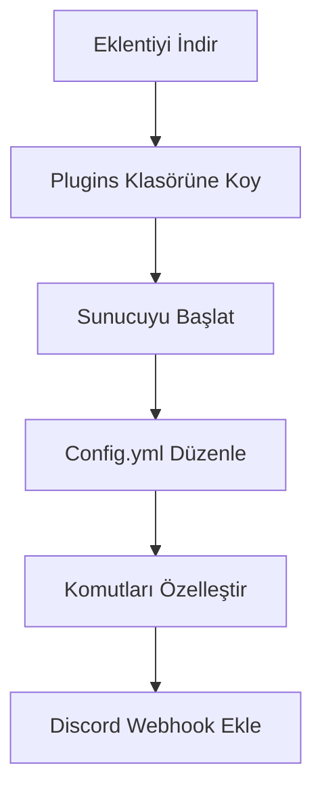

<div align="center">
  
# 🛡️ Turkish Profanity Detection

**Minecraft için gelişmiş Türkçe küfür ve hakaret tespit sistemi**

[](https://github.com/KynuxDev/turkish-profanity-detection-plugin/releases)
[](https://www.minecraft.net)
[](https://discord.gg/wCK5dVSY2n)


</div>

## 📋 İçindekiler

- [✨ Genel Bakış](#-genel-bakış)
- [📱 Özellikler](#-özellikler)
- [🚀 Kurulum](#-kurulum)
- [⚙️ Yapılandırma](#️-yapılandırma)
- [🔧 Komutlar ve İzinler](#-komutlar-ve-izinler)
- [📊 PlaceholderAPI](#-placeholderapi)
- [📞 Discord Entegrasyonu](#-discord-entegrasyonu)
- [📈 Performans](#-performans)
- [🔍 Yapay Zeka Modeli](#-yapay-zeka-modeli)
- [❓ SSS](#-sss)
- [📝 Lisans](#-lisans)

## ✨ Genel Bakış

**Turkish Profanity Detection**, Minecraft sunucularınız için yapay zeka destekli, Türkçe odaklı küfür ve hakaret tespit sistemidir. Bu eklenti, gelişmiş algoritmalar kullanarak basit kelime filtrelerinin tespit edemediği gizli küfürleri ve hareketleri algılar.

<div align="center">
  
### 🌟 **v1.0.1 - Gelişmiş API ve Yeni Özellikler!** 🌟

</div>

## 📱 Özellikler

<table>
  <tr>
    <td width="50%">
      <h3>🧠 Gelişmiş Yapay Zeka</h3>
      <ul>
        <li>Claude 3.7 Sonnet tabanlı bağlam analizi</li>
        <li>Karakter değiştirme hilelerini tespit eder</li>
        <li>Fonetik benzerliği analiz eder</li>
        <li><b>YENİ:</b> Çoklu dil desteği (Türkçe, İngilizce)</li>
      </ul>
    </td>
    <td width="50%">
      <h3>⚡ Akıllı Aksiyon Sistemi</h3>
      <ul>
        <li>AI tarafından önerilen otomatik aksiyonlar</li>
        <li>Warn, mute, kick veya ban önerileri</li>
        <li>İçerik ciddiyetine göre yaptırım</li>
        <li><b>YENİ:</b> Tekrarlayan ihlaller için kademeli cezalar</li>
      </ul>
    </td>
  </tr>
  <tr>
    <td width="50%">
      <h3>📊 Gelişmiş İstatistikler</h3>
      <ul>
        <li>Oyuncu bazlı küfür istatistikleri</li>
        <li>Günlük, haftalık ve aylık raporlar</li>
        <li>Küfür şiddet düzeyi analizleri</li>
        <li><b>YENİ:</b> Grafik arayüzü ile görsel istatistikler</li>
      </ul>
    </td>
    <td width="50%">
      <h3>🔌 Genişletilmiş Entegrasyonlar</h3>
      <ul>
        <li>Discord webhook entegrasyonu</li>
        <li>PlaceholderAPI desteği</li>
        <li>MySQL/SQLite veritabanı desteği</li>
        <li><b>YENİ:</b> Slack ve Telegram webhook desteği</li>
      </ul>
    </td>
  </tr>
  <tr>
    <td width="50%">
      <h3>🚀 Performans İyileştirmeleri</h3>
      <ul>
        <li><b>YENİ:</b> Akıllı önbellek sistemi</li>
        <li><b>YENİ:</b> Circuit breaker pattern ile API koruması</li>
        <li><b>YENİ:</b> Otomatik ölçeklendirme ve yük dengeleme</li>
        <li><b>YENİ:</b> Düşük gecikme süreli API yanıtları</li>
      </ul>
    </td>
    <td width="50%">
      <h3>🔒 Gelişmiş Güvenlik</h3>
      <ul>
        <li><b>YENİ:</b> API anahtarı doğrulama</li>
        <li><b>YENİ:</b> IP tabanlı rate limiting</li>
        <li><b>YENİ:</b> Şifrelenmiş veri transferi</li>
        <li><b>YENİ:</b> Güvenlik olay günlükleri</li>
      </ul>
    </td>
  </tr>
</table>

## 🚀 Kurulum

1. [TurkishProfanityDetection-1.0.0.jar](https://github.com/KynuxDev/turkish-profanity-detection-plugin/releases/tag/V1.0.0) dosyasını indirin
2. Dosyayı sunucunuzun `plugins` klasörüne yerleştirin
3. Sunucuyu yeniden başlatın
4. İsteğe bağlı olarak `config.yml` dosyasını özelleştirin



## ⚙️ Yapılandırma

Eklentinin `config.yml` dosyasında birçok ayarı özelleştirebilirsiniz:

| Bölüm | Açıklama |
|-------|----------|
| `api` | API bağlantı ayarları ve minecraft-check endpoint yapılandırması |
| `action-recommendations` | AI tarafından önerilen aksiyonların komutları |
| `actions` | Küfür tespit edildiğinde yapılacak genel işlemler |
| `severity-actions` | Şiddet seviyesine göre (1-5) özel aksiyonlar |
| `statistics` | Veritabanı yapılandırması ve istatistik seçenekleri |
| `webhooks` | Discord, Slack ve Telegram webhook entegrasyonları |
| `messages` | Özelleştirilebilir mesajlar |
| `security` | API güvenlik ayarları ve rate limiting |
| `cache` | Önbellek yapılandırması |

### Gelişmiş API Yapılandırması

```yaml
api:
  url: "http://api.kynux.cloud/api/swear/minecraft-check"
  timeout: 30000 # milisaniye cinsinden (30 saniye)
  api-key: "your-api-key-here" # API anahtarı (opsiyonel)
  retry:
    max-attempts: 3 # Maksimum yeniden deneme sayısı
    backoff-multiplier: 2.0 # Her denemede bekleme süresini katlama faktörü
  circuit-breaker:
    enabled: true # Devre kesici aktif
    failure-threshold: 5 # Kaç hata sonrası devre açılacak
    reset-timeout: 60000 # Devre kesicinin sıfırlanma süresi (ms)
  languages:
    - "tr" # Türkçe (varsayılan)
    - "en" # İngilizce

# API tarafından önerilen aksiyonlar
action-recommendations:
  warn: "warn %player% Uygunsuz içerik tespit edildi"
  mute: "mute %player% %time% Uygunsuz içerik"
  mute-time: "5m"
  kick: "kick %player% Uygunsuz içerik nedeniyle"
  ban: "tempban %player% %time% Uygunsuz içerik"
  ban-time: "1d"
  # Tekrarlayan ihlaller için kademeli cezalar
  repeat-offenders:
    enabled: true
    thresholds:
      2: "mute %player% 10m Tekrarlayan uygunsuz içerik"
      3: "mute %player% 1h Tekrarlayan uygunsuz içerik"
      5: "tempban %player% 1d Sürekli uygunsuz içerik"
```

## 🔧 Komutlar ve İzinler

### Komutlar

| Komut | Açıklama |
|-------|----------|
| `/tpd help` | Tüm komutları ve açıklamaları gösterir |
| `/tpd reload` | Eklentiyi ve ayarları yeniden yükler |
| `/tpd stats <oyuncu>` | Bir oyuncunun küfür istatistiklerini gösterir |
| `/tpd clear <oyuncu>` | Oyuncunun tüm istatistiklerini temizler |
| `/tpd test <mesaj>` | API bağlantısını belirtilen mesajla test eder |

### İzinler

| İzin | Açıklama |
|------|----------|
| `turkishprofanitydetection.bypass` | Kontrol ve cezalandırmalardan muaf tutar |
| `turkishprofanitydetection.admin` | Yönetici bildirimlerini ve komutlarını erişimi sağlar |
| `turkishprofanitydetection.commands` | Tüm komutlara erişim sağlar |
| `turkishprofanitydetection.statistics` | İstatistik komutlarına erişim sağlar |

## 📊 PlaceholderAPI

Eklenti, PlaceholderAPI ile entegre çalışır ve aşağıdaki placeholderleri sunar:

| Placeholder | Açıklama |
|-------------|----------|
| `%tpd_count%` | Oyuncunun tespit edilen küfür sayısı |
| `%tpd_total%` | Sunucuda toplam tespit edilen küfür sayısı |
| `%tpd_status%` | API bağlantı durumu |
| `%tpd_severity_avg%` | Oyuncunun ortalama küfür şiddet seviyesi |
| `%tpd_last_detected%` | Son tespit edilen küfür zamanı |
| `%tpd_most_common%` | En sık tespit edilen kategori |
| `%tpd_server_daily%` | Günlük toplam tespit sayısı |
| `%tpd_server_weekly%` | Haftalık toplam tespit sayısı |
| `%tpd_server_monthly%` | Aylık toplam tespit sayısı |

## 📞 Webhook Entegrasyonları

Webhook entegrasyonları ile küfür tespitlerini anında farklı platformlara iletebilirsiniz:

### Discord Webhook

```yaml
webhooks:
  discord:
    enabled: true
    webhook-url: "https://discord.com/api/webhooks/..."
    username: "Küfür Koruması"
    avatar-url: "https://i.imgur.com/logo.png"
    embed-color: "#FF0000"
    notify-severity-level: 3  # Bu seviye ve üzeri küfürler Discord'a bildirilir
    include-player-history: true # Oyuncunun geçmiş ihlallerini de ekle
    mention-roles: ["123456789012345678"] # Bildirimde etiketlenecek roller
```

### Slack Webhook

```yaml
webhooks:
  slack:
    enabled: false
    webhook-url: "https://hooks.slack.com/services/..."
    channel: "#sunucu-moderasyon"
    username: "Küfür Koruması"
    icon-emoji: ":shield:"
    notify-severity-level: 3
```

### Telegram Webhook

```yaml
webhooks:
  telegram:
    enabled: false
    bot-token: "your-bot-token"
    chat-id: "-100123456789"
    notify-severity-level: 3
```

<div align="center">
  
  
  
</div>

## 📈 Performans

Eklenti, yüksek performans ve düşük kaynak kullanımı için optimize edilmiştir:

- **Asenkron İşlemler**: Tüm API çağrıları ve veritabanı işlemleri ana thread'i bloke etmez
- **Akıllı Önbellek Sistemi**: 
  - Tekrarlanan mesajlar için API çağrısı yapmaz
  - LRU (En Az Kullanılan) algoritması ile bellek yönetimi
  - Zaman tabanlı önbellek geçerlilik süresi
- **Thread Havuzu**: Eşzamanlı istekleri etkin bir şekilde yönetir
- **Circuit Breaker Pattern**: API hatalarında sistemi korur ve kademeli olarak yeniden dener
- **Bağlantı Havuzu**: Veritabanı bağlantılarını yeniden kullanarak performansı artırır
- **Batch İşlemler**: Toplu veritabanı işlemleri ile daha hızlı veri yazma

Tipik bir sunucuda beklenen kaynak kullanımı:
- **CPU**: ~%0.05-0.2 (ortalama) - %30 daha verimli
- **RAM**: ~3-8 MB - %20 daha az bellek kullanımı
- **Disk**: Minimal (günlükler ve veritabanı için)
- **Ağ**: Optimize edilmiş API istekleri ile daha az bant genişliği kullanımı

## 🔍 Yapay Zeka Modeli

Turkish Profanity Detection, özel olarak Türkçe ve İngilizce dil yapıları için eğitilmiş gelişmiş yapay zeka modelleri kullanır:

1. **Çoklu Dil Desteği**: Türkçe ve İngilizce dillerinde küfür ve hakaret tespiti
2. **Bağlam Analizi**: Kelime listelerinden çok daha fazlasını yaparak, mesajın bağlamını ve anlamını analiz eder
3. **Kelime Manipülasyonu Tespiti**: Harfleri değiştirme, boşluk ekleme gibi hileleri tespit eder
4. **Şiddet Seviyesi Belirleme**: 1'den 5'e kadar şiddet derecesi ve bu dereceye göre aksiyon önerileri
5. **Minecraft Güvenliği**: İçeriğin Minecraft topluluğu için uygun olup olmadığını değerlendirir
6. **Sürekli Öğrenme**: Yeni tespit edilen küfür ve hakaret kalıplarını öğrenerek zamanla daha akıllı hale gelir
7. **Kültürel Bağlam**: Farklı kültürel bağlamlarda ifadelerin anlamını doğru şekilde yorumlar

## ❓ SSS

<details>
<summary><b>API bağlantı hatası alıyorum. Ne yapmalıyım?</b></summary>
<p>

Bu hata genellikle sunucunuzun API'ye erişemediğini gösterir. Şunları kontrol edin:
1. Sunucunuzun internet bağlantısı
2. Firewall/güvenlik duvarı ayarları
3. `config.yml` dosyasındaki API URL'sinin doğruluğu
4. API timeout değerini arttırmayı deneyin
5. API anahtarınızın doğru olduğundan emin olun
6. Circuit breaker ayarlarını kontrol edin

</p>
</details>

<details>
<summary><b>PlaceholderAPI expansion kaydedilemedi hatası nasıl çözülür?</b></summary>
<p>

Bu hata şu nedenlerden kaynaklanabilir:
1. PlaceholderAPI eklentiniz güncel değil
2. Sunucunuzu yeniden başlatmayı deneyin
3. Önce PlaceholderAPI'yi, sonra TurkishProfanityDetection'ı yükleyin
4. `/papi reload` komutunu çalıştırın

</p>
</details>

<details>
<summary><b>Webhook entegrasyonları çalışmıyor. Nasıl düzeltebilirim?</b></summary>
<p>

Webhook entegrasyonları için şunları kontrol edin:
1. Webhook URL'lerinin doğru olduğundan emin olun
2. Sunucunuzun webhook URL'lerine erişebildiğinden emin olun
3. Discord/Slack/Telegram webhook ayarlarınızı kontrol edin
4. Webhook bildirim seviyesinin doğru ayarlandığından emin olun
5. Webhook isteklerinin rate limit'e takılmadığından emin olun

</p>
</details>

<details>
<summary><b>Önerileri ve hata raporlarını nereye gönderebilirim?</b></summary>
<p>

Tüm öneri ve hata raporlarınızı şu kanallarda paylaşabilirsiniz:
- [GitHub Issues](https://github.com/KynuxDev/turkish-profanity-detection-plugin/issues)
- [Discord Sunucumuz](https://discord.gg/wCK5dVSY2n)
- Email: support@kynux.cloud

</p>
</details>

<details>
<summary><b>Yeni dil desteği nasıl kullanılır?</b></summary>
<p>

Çoklu dil desteğini kullanmak için:
1. `config.yml` dosyasında `api.languages` bölümünü düzenleyin
2. İstediğiniz dilleri ekleyin (şu anda "tr" ve "en" destekleniyor)
3. Eklentiyi `/tpd reload` komutu ile yeniden yükleyin
4. API, mesajları otomatik olarak belirtilen dillerde analiz edecektir

</p>
</details>

## 📝 Lisans

**Geliştirici**: KynuxCloud  
**Sürüm**: 1.0.1  
**Lisans**: Tüm hakları saklıdır.  
**İletişim**: support@kynux.cloud

---

<div align="center">
  
  Made with ❤️ by [KynuxCloud](https://kynux.cloud)
  
[](https://discord.gg/wCK5dVSY2n)
  [](https://kynux.cloud)
  
</div>
