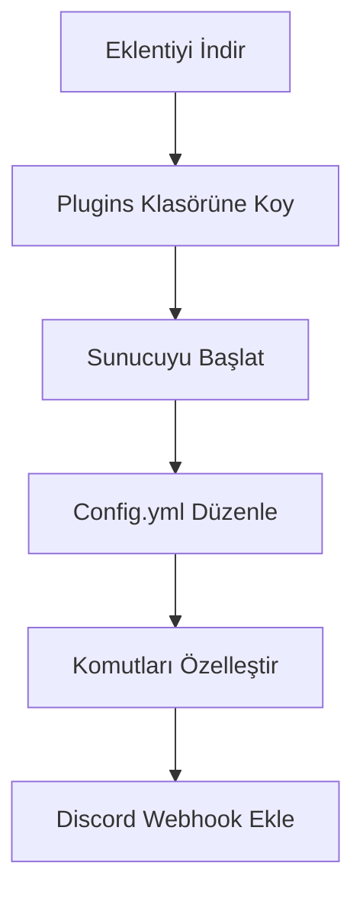

<div align="center">
  
# 🛡️ Turkish Profanity Detection

**Minecraft için gelişmiş Türkçe küfür ve hakaret tespit sistemi**

[](https://github.com/KynuxDev/turkish-profanity-detection-plugin/releases)
[](https://www.minecraft.net)
[](https://discord.gg/wCK5dVSY2n)


</div>

## 📋 İçindekiler

- [✨ Genel Bakış](#-genel-bakış)
- [📱 Özellikler](#-özellikler)
- [🚀 Kurulum](#-kurulum)
- [⚙️ Yapılandırma](#️-yapılandırma)
- [🔧 Komutlar ve İzinler](#-komutlar-ve-izinler)
- [📊 PlaceholderAPI](#-placeholderapi)
- [📞 Discord Entegrasyonu](#-discord-entegrasyonu)
- [📈 Performans](#-performans)
- [🔍 Yapay Zeka Modeli](#-yapay-zeka-modeli)
- [❓ SSS](#-sss)
- [📝 Lisans](#-lisans)

## ✨ Genel Bakış

**Turkish Profanity Detection**, Minecraft sunucularınız için yapay zeka destekli, Türkçe odaklı küfür ve hakaret tespit sistemidir. Bu eklenti, gelişmiş algoritmalar kullanarak basit kelime filtrelerinin tespit edemediği gizli küfürleri ve hareketleri algılar.

<div align="center">
  
### 🌟 **v1.0.1 - Gelişmiş API ve Yeni Özellikler!** 🌟

</div>

## 📱 Özellikler

<table>
  <tr>
    <td width="50%">
      <h3>🧠 Gelişmiş Yapay Zeka</h3>
      <ul>
        <li><b>Ana Analiz Motoru:</b> Kynux AI (örn: o3-mini, GPT-4) entegrasyonu ile esnek ve güçlü içerik analizi.</li>
        <li>Karakter değiştirme (örneğin, a yerine @) gibi yaygın gizleme taktiklerini anlama yeteneği.</li>
        <li>Fonetik benzerlikleri ve argo kullanımlarını değerlendirme.</li>
        <li>Yapılandırılabilir sistem mesajları ile AI davranışını yönlendirme.</li>
      </ul>
    </td>
    <td width="50%">
      <h3>⚡ Akıllı Aksiyon Sistemi</h3>
      <ul>
        <li>AI tarafından önerilen otomatik aksiyonlar</li>
        <li>Warn, mute, kick veya ban önerileri</li>
        <li>İçerik ciddiyetine göre yaptırım</li>
        <li><b>YENİ:</b> Tekrarlayan ihlaller için kademeli cezalar</li>
      </ul>
    </td>
  </tr>
  <tr>
    <td width="50%">
      <h3>📊 Gelişmiş İstatistikler</h3>
      <ul>
        <li>Oyuncu bazlı küfür istatistikleri</li>
        <li>Günlük, haftalık ve aylık raporlar</li>
        <li>Küfür şiddet düzeyi analizleri</li>
        <li><b>YENİ:</b> Grafik arayüzü ile görsel istatistikler</li>
      </ul>
    </td>
    <td width="50%">
      <h3>🔌 Genişletilmiş Entegrasyonlar</h3>
      <ul>
        <li>Discord webhook entegrasyonu</li>
        <li>PlaceholderAPI desteği</li>
        <li>MySQL/SQLite veritabanı desteği</li>
        <li><b>YENİ:</b> Slack ve Telegram webhook desteği</li>
      </ul>
    </td>
  </tr>
  <tr>
    <td width="50%">
      <h3>🚀 Performans İyileştirmeleri</h3>
      <ul>
        <li><b>YENİ:</b> Akıllı önbellek sistemi</li>
        <li><b>YENİ:</b> Circuit breaker pattern ile API koruması</li>
        <li><b>YENİ:</b> Otomatik ölçeklendirme ve yük dengeleme</li>
        <li><b>YENİ:</b> Düşük gecikme süreli API yanıtları</li>
      </ul>
    </td>
    <td width="50%">
      <h3>🔒 Gelişmiş Güvenlik</h3>
      <ul>
        <li><b>YENİ:</b> API anahtarı doğrulama</li>
        <li><b>YENİ:</b> IP tabanlı rate limiting</li>
        <li><b>YENİ:</b> Şifrelenmiş veri transferi</li>
        <li><b>YENİ:</b> Güvenlik olay günlükleri</li>
      </ul>
    </td>
  </tr>
</table>

## 🚀 Kurulum

1. [TurkishProfanityDetection-1.0.1.jar](https://github.com/KynuxDev/turkish-profanity-detection-plugin/releases/tag/V1.0.1) dosyasını indirin
2. Dosyayı sunucunuzun `plugins` klasörüne yerleştirin
3. Sunucuyu yeniden başlatın
4. İsteğe bağlı olarak `config.yml` dosyasını özelleştirin



## ⚙️ Yapılandırma

Eklentinin `config.yml` dosyasında birçok ayarı özelleştirebilirsiniz:

| Bölüm | Açıklama |
|-------|----------|
| `kynux_api` | Kynux AI (örn: o3-mini) API bağlantı ayarları (URL, API anahtarı, model, timeout). Bu, eklentinin ana analiz motorudur. |
| `action-recommendations` | Kynux AI tarafından önerilen aksiyonların (warn, mute, kick, ban) çalıştıracağı komutlar. |
| `actions` | Küfür tespit edildiğinde yapılacak genel işlemler (mesaj iptali, loglama vb.). |
| `severity-actions` | Şiddet seviyesine göre (1-5) özel aksiyonlar |
| `statistics` | Veritabanı yapılandırması ve istatistik seçenekleri |
| `webhooks` | Discord, Slack ve Telegram webhook entegrasyonları |
| `messages` | Özelleştirilebilir mesajlar |
| `security` | API güvenlik ayarları ve rate limiting |
| `cache` | Önbellek yapılandırması |

### Kynux AI API Yapılandırması

KynuxCloud API anahtarınızı almak için [api.kynux.cloud](https://api.kynux.cloud) adresinden kayıt olmanız gerekmektedir.

<div align="center">
  <a href="https://api.kynux.cloud" target="_blank">
    
  </a>
</div>

Eklentinin ana analiz motoru olan Kynux AI'nın yapılandırması `config.yml` dosyasındaki `kynux_api` bölümünden yapılır:

```yaml
# Kynux AI API Ayarları (Ana Yapay Zeka Entegrasyonu)
kynux_api:
  # Kynux AI Chat Completion API endpoint'i
  url: "https://api.kynux.cloud/api/v1/chat/completion"
  # Kynux AI API anahtarınız. Bu alanı DOLDURMANIZ GEREKİR.
  key: "YOUR_KYNUX_API_KEY_HERE" 
  # Kullanılacak yapay zeka modeli. Örn: "o3-mini", "gpt-4", vb.
  model: "o3-mini"
  # API istekleri için zaman aşımı süresi (milisaniye cinsinden)
  timeout: 30000 # 30 saniye

# API tarafından önerilen aksiyonlar
# Bu komutlar, Kynux AI'nın "action_recommendation" yanıtına göre çalıştırılır.
action-recommendations:
  warn: "warn %player% Uygunsuz içerik tespit edildi"
  mute: "mute %player% %time% Uygunsuz içerik"
  mute-time: "5m"
  kick: "kick %player% Uygunsuz içerik nedeniyle"
  ban: "tempban %player% %time% Uygunsuz içerik"
  ban-time: "1d"
  # Tekrarlayan ihlaller için kademeli cezalar
  repeat-offenders:
    enabled: true
    thresholds:
      2: "mute %player% 10m Tekrarlayan uygunsuz içerik"
      3: "mute %player% 1h Tekrarlayan uygunsuz içerik"
      5: "tempban %player% 1d Sürekli uygunsuz içerik"
```

## 🔧 Komutlar ve İzinler

### Komutlar

| Komut | Açıklama |
|-------|----------|
| `/tpd help` | Tüm komutları ve açıklamaları gösterir. |
| `/tpd reload` | Eklentiyi ve ayarları yeniden yükler. |
| `/tpd stats <oyuncu>` | Bir oyuncunun küfür istatistiklerini gösterir. |
| `/tpd clear <oyuncu|all>` | Belirtilen oyuncunun veya tüm oyuncuların küfür istatistiklerini temizler. |
| `/tpd kynuxai <mesaj>` | Belirtilen mesajı Kynux AI ile analiz eder ve sonucu gösterir (Admin yetkisi gerektirir). |

### İzinler

| İzin | Açıklama |
|------|----------|
| `turkishprofanitydetection.bypass` | Kontrol ve cezalandırmalardan muaf tutar |
| `turkishprofanitydetection.admin` | Yönetici bildirimlerini ve komutlarını erişimi sağlar |
| `turkishprofanitydetection.commands` | Tüm komutlara erişim sağlar |
| `turkishprofanitydetection.statistics` | İstatistik komutlarına erişim sağlar |

## 📊 PlaceholderAPI

Eklenti, PlaceholderAPI ile entegre çalışır ve aşağıdaki placeholderleri sunar:

| Placeholder | Açıklama |
|-------------|----------|
| `%tpd_count%` | Oyuncunun tespit edilen küfür sayısı |
| `%tpd_total%` | Sunucuda toplam tespit edilen küfür sayısı |
| `%tpd_status%` | Kynux AI API bağlantı durumu (Bu placeholder gelecekte eklenebilir, şu an aktif değil). |
| `%tpd_severity_avg%` | Oyuncunun ortalama küfür şiddet seviyesi. |
| `%tpd_last_detected%` | Son tespit edilen küfür zamanı. |
| `%tpd_most_common%` | En sık tespit edilen kategori |
| `%tpd_server_daily%` | Günlük toplam tespit sayısı |
| `%tpd_server_weekly%` | Haftalık toplam tespit sayısı |
| `%tpd_server_monthly%` | Aylık toplam tespit sayısı |

## 📞 Webhook Entegrasyonları

Webhook entegrasyonları ile küfür tespitlerini anında farklı platformlara iletebilirsiniz:

### Discord Webhook

```yaml
webhooks:
  discord:
    enabled: true
    webhook-url: "https://discord.com/api/webhooks/..."
    username: "Küfür Koruması"
    avatar-url: "https://i.imgur.com/logo.png"
    embed-color: "#FF0000"
    notify-severity-level: 3  # Bu seviye ve üzeri küfürler Discord'a bildirilir
    include-player-history: true # Oyuncunun geçmiş ihlallerini de ekle
    mention-roles: ["123456789012345678"] # Bildirimde etiketlenecek roller
```

### Slack Webhook

```yaml
webhooks:
  slack:
    enabled: false
    webhook-url: "https://hooks.slack.com/services/..."
    channel: "#sunucu-moderasyon"
    username: "Küfür Koruması"
    icon-emoji: ":shield:"
    notify-severity-level: 3
```

### Telegram Webhook

```yaml
webhooks:
  telegram:
    enabled: false
    bot-token: "your-bot-token"
    chat-id: "-100123456789"
    notify-severity-level: 3
```

<div align="center">
  
  
  
</div>

## 📈 Performans

Eklenti, yüksek performans ve düşük kaynak kullanımı için optimize edilmiştir:

- **Asenkron İşlemler**: Tüm API çağrıları ve veritabanı işlemleri ana thread'i bloke etmez
- **Akıllı Önbellek Sistemi**: 
  - Tekrarlanan mesajlar için API çağrısı yapmaz
  - LRU (En Az Kullanılan) algoritması ile bellek yönetimi
  - Zaman tabanlı önbellek geçerlilik süresi
- **Thread Havuzu**: Eşzamanlı istekleri etkin bir şekilde yönetir
- **Circuit Breaker Pattern**: API hatalarında sistemi korur ve kademeli olarak yeniden dener
- **Bağlantı Havuzu**: Veritabanı bağlantılarını yeniden kullanarak performansı artırır
- **Batch İşlemler**: Toplu veritabanı işlemleri ile daha hızlı veri yazma

Tipik bir sunucuda beklenen kaynak kullanımı:
- **CPU**: ~%0.05-0.2 (ortalama) - %30 daha verimli
- **RAM**: ~3-8 MB - %20 daha az bellek kullanımı
- **Disk**: Minimal (günlükler ve veritabanı için)
- **Ağ**: Optimize edilmiş API istekleri ile daha az bant genişliği kullanımı

## 🔍 Yapay Zeka Modeli

Turkish Profanity Detection, özel olarak Türkçe ve İngilizce dil yapıları için eğitilmiş gelişmiş yapay zeka modelleri kullanır:

Eklenti, Kynux AI (örneğin o3-mini, GPT-4 gibi modeller) kullanarak metin analizi yapar. `KynuxAIService.java` içinde tanımlanan sistem mesajı (system prompt), AI'dan aşağıdaki gibi bir JSON formatında yanıt vermesini ister:

```json
{
  "is_profane": true, // boolean: Mesaj küfür içeriyor mu?
  "is_safe_for_minecraft": false, // boolean: Mesaj Minecraft için uygun mu?
  "severity": 4, // int (0-5): Küfürün şiddeti (0: küfür yok)
  "category": "hate_speech", // string: Küfür kategorisi (örn: insult, sexual, hate_speech, spam, other)
  "detected_word": "örnek_küfür", // string: Tespit edilen anahtar kelime/ifade
  "action_recommendation": "ban", // string: Önerilen aksiyon (none, warn, mute, kick, ban)
  "analysis_details": "Mesaj, nefret söylemi içeriyor ve oyuncuya karşı saldırgan bir dil kullanıyor." // string: Analizin kısa açıklaması
}
```

Bu yapı sayesinde eklenti, AI'dan gelen detaylı analiz sonuçlarına göre hareket eder.

## ❓ SSS

<details>
<summary><b>API bağlantı hatası alıyorum. Ne yapmalıyım?</b></summary>
<p>

Bu hata genellikle sunucunuzun Kynux AI API'sine erişemediğini gösterir. Şunları kontrol edin:
1. Sunucunuzun internet bağlantısının aktif olduğundan emin olun.
2. Sunucu güvenlik duvarınızın (firewall) veya ağ yapılandırmanızın giden HTTPS (genellikle port 443) bağlantılarına izin verdiğinden emin olun.
3. `config.yml` dosyasındaki `kynux_api.url` adresinin doğru ve erişilebilir olduğunu kontrol edin.
4. `config.yml` dosyasındaki `kynux_api.key` alanına geçerli bir Kynux AI API anahtarı girdiğinizden emin olun. API anahtarı olmadan istekler başarısız olacaktır.
5. `kynux_api.timeout` değerini, özellikle yavaş bağlantılarda veya yoğun API kullanımında, gerekirse artırmayı deneyin.

</p>
</details>

<details>
<summary><b>PlaceholderAPI entegrasyonu çalışmıyor veya `expansion kaydedilemedi` hatası alıyorum.</b></summary>
<p>

Bu sorun genellikle aşağıdaki nedenlerden kaynaklanır:
1. PlaceholderAPI eklentisinin sunucunuzda kurulu ve güncel olduğundan emin olun.
2. Sunucunuzu yeniden başlatmayı deneyin. Bazen eklenti yükleme sıralaması sorunlara yol açabilir.
3. PlaceholderAPI yüklendikten sonra Turkish Profanity Detection eklentisinin yüklendiğinden emin olun.
4. Konsolda `/papi reload` komutunu kullanarak PlaceholderAPI'yi yeniden yüklemeyi deneyin.

</p>
</details>

<details>
<summary><b>Discord webhook entegrasyonu çalışmıyor.</b></summary>
<p>

Discord webhook entegrasyonu için aşağıdaki adımları kontrol edin:
1. `config.yml` dosyasındaki `actions.discord.enabled` ayarının `true` olduğundan emin olun.
2. `actions.discord.webhook-url` alanına geçerli bir Discord webhook URL'si girdiğinizden emin olun.
3. Sunucunuzun Discord webhook URL'sine (genellikle `discord.com` veya `discordapp.com` adreslerine) giden HTTPS bağlantılarına izin verdiğinden emin olun.
4. `actions.discord.notify-severity-level` ayarının, bildirim almak istediğiniz minimum küfür şiddet seviyesine doğru ayarlandığından emin olun.

</p>
</details>

<details>
<summary><b>Önerilerimi ve hata raporlarımı nereye gönderebilirim?</b></summary>
<p>

Tüm önerilerinizi, geri bildirimlerinizi ve hata raporlarınızı aşağıdaki kanallar aracılığıyla bize iletebilirsiniz:
- **GitHub Issues:** [Projenin GitHub Issues Sayfası](https://github.com/KynuxDev/turkish-profanity-detection-plugin/issues) (Tercih edilen yöntem)
- **Discord Sunucumuz:** [Kynux Cloud Discord](https://discord.gg/wCK5dVSY2n)
- **E-posta:** support@kynux.cloud

</p>
</details>

<details>
<summary><b>Kynux AI farklı dilleri analiz edebilir mi?</b></summary>
<p>

Evet, Kynux AI (özellikle GPT tabanlı modeller) birçok dili anlayabilir ve analiz edebilir. Eklenti şu anda özel olarak bir dil yapılandırması sunmasa da, Kynux AI'a gönderilen sistem mesajı (system prompt) AI'nın genel dil yeteneklerini kullanmasını sağlar. Eğer belirli dillerde daha iyi sonuçlar almak veya AI'nın davranışını o dillere göre özelleştirmek isterseniz, `KynuxAIService.java` içindeki `systemPrompt` değişkenini buna göre düzenleyebilirsiniz. Gelecek sürümlerde dil yapılandırması eklenebilir.

</p>
</details>

## 📝 Lisans

**Geliştirici**: KynuxCloud  
**Sürüm**: 1.0.1  
**Lisans**: Tüm hakları saklıdır.  
**İletişim**: support@kynux.cloud

---

<div align="center">
  
  Made with ❤️ by [KynuxCloud](https://kynux.cloud)
  
[](https://discord.gg/wCK5dVSY2n)
[](https://kynux.cloud)
[](https://api.kynux.cloud)

</div>
